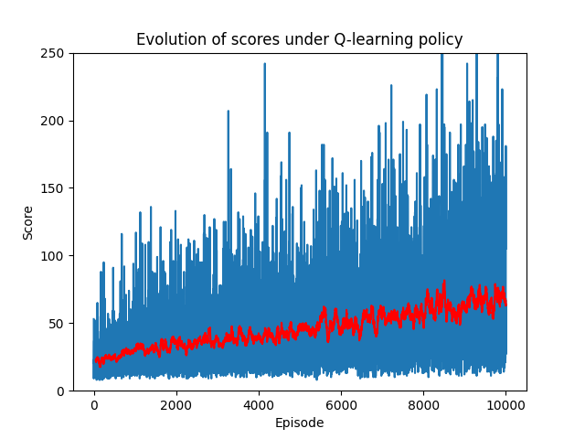
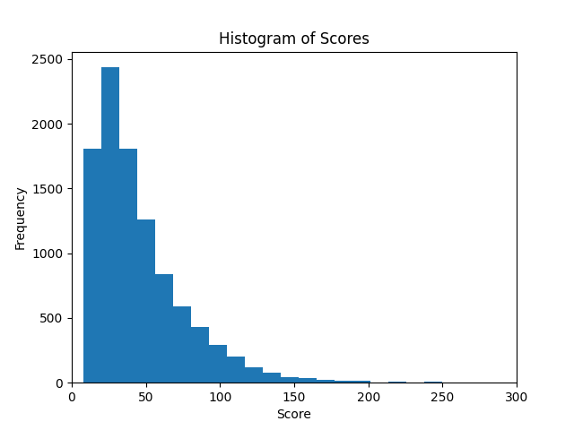
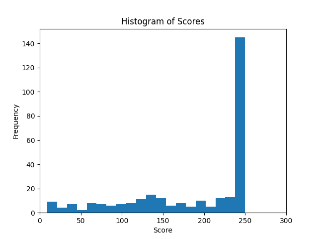
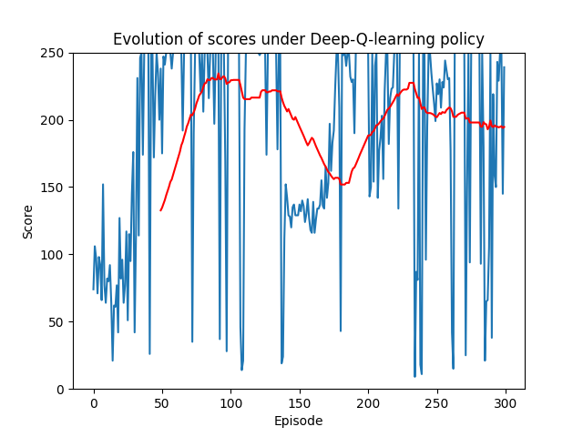

# Reinforcement Learning: Cart pole

In this project, both a `QLearningAgent` and `DeepQLearningAgent` are implemented and trained to interact and play with the OpenAI Gym CartPole environment. In the CartPole game, the goal is to balance a pole on top of a moving cart, navigating the system to prevent the pole from falling over. Players aim to achieve a stable equilibrium by strategically controlling the cart's movements, with the objective of maximizing the duration the pole remains upright to score higher points.

In the CartPole environment, the states represent the current configuration of the system, including the position and velocity of the cart as well as the angle and angular velocity of the pole. These state variables influence the agent's decisions and play a crucial role in the learning process.

An agent can be created by instantiating either the `QLearningAgent` and `DeepQLearningAgent` class. Each agent instance contains a `choose` method which chooses the optimal policy based on the epsilon greedy strategy. The `Qlearning` and `DeepQlearning` files contain an implementation of the training loop, and the `utils.py` file contains implementations of functions used for graphing and computing moving averages.

## Q learning agent

A Q learning agent creates a Q-value table for each of the discretized states (position, velocity, angle, angular velocity). The agent is trained with learning rate of $0.10$, discount of $0.90$, and epsilon of $0.75$. The learning rate $\eta$ and epsilon $\epsilon$ is decreased exponentially by the following scheme

```math
\begin{equation*}
  \begin{cases}
    \eta = \max(\eta * (1-10^{-8}), 0.01)\\
    \epsilon = \max(\epsilon * (1-10^{-6}), 0.01)\\
  \end{cases}
\end{equation*}
```
The Q-learning agent is trained for 10000 episodes. In the five test episodes, the scores are 161.0, 147.0, 133.0, 224.0, and 69.0. The training curve moving average is shown below

<div align="center">
  
  
</div>

<p align="center">
  Figure 1: (Left) Training curve of Q-learning agent. (Right) Distribution of training scores.
</p>

The graph illustrates a gradual increase in the average performance of the Q-Learning agent as the number of training episodes rises. Despite this, after reaching 10,000 episodes, the average score remains below 50. One possible explanation could be the Q-table size, which might be excessively large.

## Deep Q learning agent

The parameter values for the Deep Q learning agent is the same as the Q learning agent. The Q value function is replaced by a two-layer linear neural network with relu activation. The hidden size of the neural network is set to be 128. For training, the adam optimizer is used. The agent is trained for 300 episodes. In the five test episodes, the scores are 207.0, 202.0, 208.0, 210.0, and 210.0. The training curve moving average is shown below

<div align="center">
  
  
</div>

<p align="center">
  Figure 3: (Left) Training curve of Deep Q-learning agent. (Right) Distribution of training scores.
</p>


